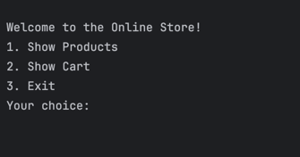
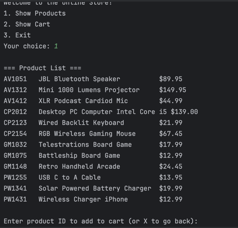
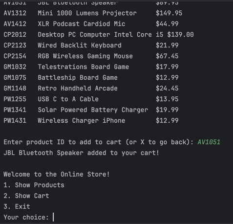
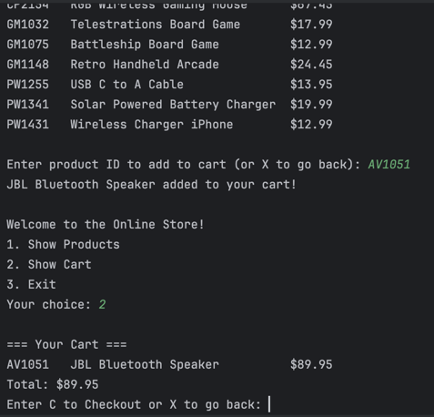
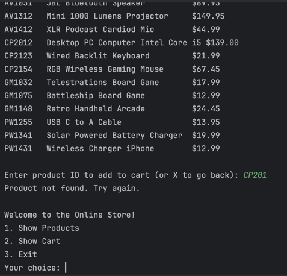
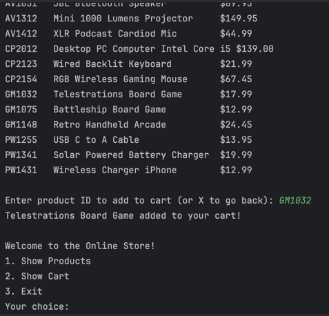
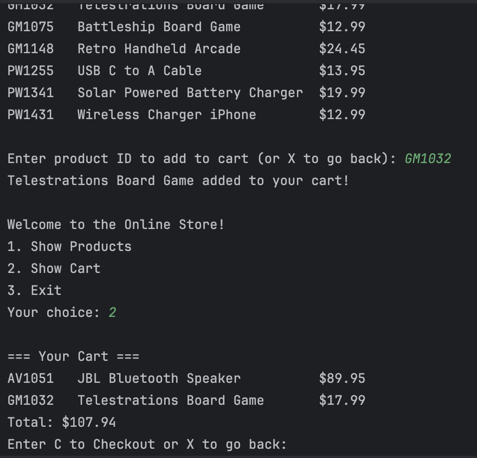
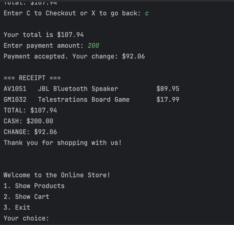

# Online Store (CLI Application)

## Description of the Project

This project is a simple Command-Line Interface (CLI) Online Store Application built in Java.  
It allows users to browse products, add them to a shopping cart, and proceed to checkout all through a text-based interface.

## User Stories

- As a customer, I want to view all available products so that I can see what the store offers.
- As a customer, I want to add products to my cart so that I can purchase them later.
- As a customer, I want to view my cart so that I can see the total cost before checkout.
- As a customer, I want to remove or adjust items in my cart so that I can modify my purchase easily.
- As a customer, I want to check out and pay for my items so that I can complete my order.
- As a user, I want clear feedback and instructions so that I know how to navigate the store interface.
- As a developer, I want to write modular, reusable code so that the application can be easily extended later.

---
## Setup

Instructions on how to set up and run the project using IntelliJ IDEA.

### Prerequisites

- IntelliJ IDEA: Ensure you have IntelliJ IDEA installed, which you can download from [here](https://www.jetbrains.com/idea/download/).
- Java SDK: Make sure Java SDK is installed and configured in IntelliJ.

### Running the Application in IntelliJ

Follow these steps to get your application running within IntelliJ IDEA:

1. Open IntelliJ IDEA.
2. Select "Open" and navigate to the directory where you cloned or downloaded the project.
3. After the project opens, wait for IntelliJ to index the files and set up the project.
4. Find the main class with the `public static void main(String[] args)` method.
5. Right-click on the file and select 'Run 'Store.java' to start the application.

## Technologies Used

- Java (Version 17)
- IntelliJ IDEA (for development and testing)
- CSV File I/O (for product data loading)
- Java Collections Framework (ArrayList for inventory and cart management)

## Demo

## Future Work

- Implement quantity tracking so repeated items in the cart display as one line with a count.
- Add a receipt generator that saves checkout details to a text file in a Receipts folder.
- Include remove item functionality from the cart.
- Improve error handling and input validation during checkout.
- Add search filtering by product name or department.

## Resources

List resources such as tutorials, articles, or documentation that helped you during the project.

- [Java Programming Tutorial](https://www.example.com)
- [Effective Java](https://www.example.com)

## Team Members

Wasid Chowdhury

## Thanks

- Thank you to Raymond the potato sensei for continuous support and guidance.
